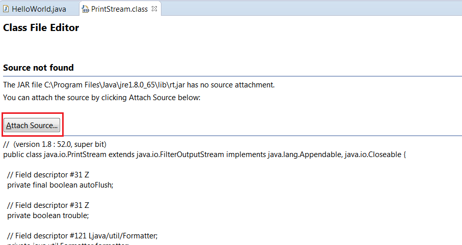

Open Editors is an eclipse plugin. It adds a view that shows all open editors in a vertical list. 
You can sort the list by Name or Path and items can be "pinned" to the top.

This is alternative to Eclipse built-in "Switch to Editor" dialog (<kbd>Ctrl+Shift+E</kbd>), that is modal.

Published on <https://marketplace.eclipse.org/content/open-editors>

")

# Development Environment Setup

The following briefly explains the steps to set up an Eclipse IDE for development of this plug-in.

## Install Eclipse and Import the Projects

1) Clone the repository
1) Download and start Eclipse
1) Install the Plug-in Development Tools (PDE) if not done yet
    1) Help > Install New Software...
    1) Work with 'download.eclipse.org/releases/...'
    1) Select 'General Purpose Tools' > 'Eclipse Plug-in Development Environment.'
1) Import the projects from the cloned repository
    1) File > Import... > Existing Projects Into Workspace
    1) Select the repository location and import all projects
1) Run the plugin in a new Eclipse instance
    1) Right click on the plugin project and then 'Debug as' > 'Eclipse Application'
    1) In case there are plugin issues with the default launch config
        1)  go to Run > Run Configurations... and select the created configuration for the Eclipse Application
        1) go to the Plug-ins tab of the Run Configuration
        1) set 'Launch with' to 'plug-ins selected below only'
        1) make sure that only the workspace plug-ins are installed and click 'Add required plug-ins'

## Source Attachments
If you inspect classes that is included as dependency in the project (e.g. IPath) and find that there are missing source attachments, then you can install the sources of these libraries as follows:

1) Help > Install New Software ...
2) Work with 'The Eclipse Project Updates'
3) Check 'Eclipse RCP Plugin Developer Resources', 'Eclipse PDE Plugin Developer Resources', 'Eclipse SDK', 'Eclipse Platform SDK', 'API Tools Execution Environment Descriptions'

This will install several sources of libraries.

# Building the Update Site
 
TODO
