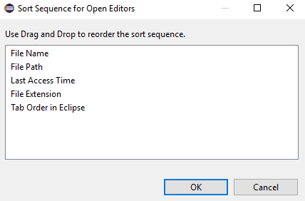
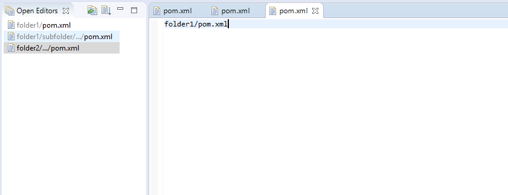

## Features
* Sort the list by several properties.
 

* Folder information is added for editors with the same name to tell them apart.
 

* Pin important editors to the top of the list

This is an alternative to the Eclipse built-in "Switch to Editor" dialog (<kbd>Ctrl+Shift+E</kbd>), which is modal.

Find the source code on [GitHub](https://github.com/dbickley/OpenEditors)

Find the plugin on the [Eclipse Marketplace](https://marketplace.eclipse.org/content/open-editors)

")
